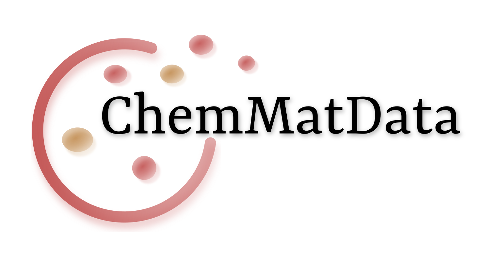
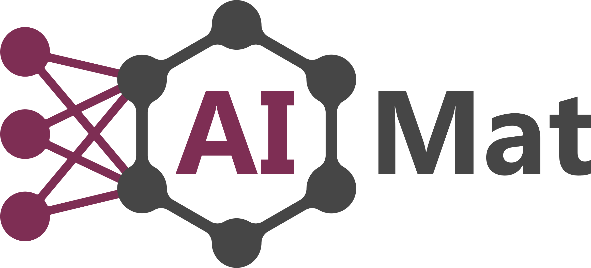

# ChemMatData
## Global collection of molecular and materials datasets



---
<!-- ABOUT THE PROJECT -->
## About The Project
Our main goal is to create a collaborative platform
where we can gather and categorize various datasets,
making them conveniently accessible in one place.
We are actively collecting datasets for molecules as well as crystalline structures to provide a comprehensive resource for researchers, scientists, and enthusiasts.

---
<!-- CONTRIBUTING -->
## Contributing
If you have additional datasets that you believe should be included in our repository, we encourage you to contribute.
Here's how you can do it:

1. Fork the Project (`git pull https://github.com/aimat-lab/ChemMatData.git`)
2. Create your Dataset / Feature Branch (`git checkout -b feature/AmazingDataset`)
3. Add your dataset either to the `molecules.md` or `materials.md files`. You add a column to the table by adding a new line and entering each entry of the table. Different entries should be separated using `|`. One of your added datasets could for example look like this:
```
| PCQM4Mv2 | Quantum Mechanics | Based on the PubChemQC, we define a meaningful ML task of predicting DFT-calculated HOMO-LUMO energy gap of molecules given their 2D molecular graphs. The HOMO-LUMO gap is one of the most practically-relevant quantum chemical properties of molecules since it is related to reactivity, photoexcitation, and charge transport. | 1 | 3,378,606 | `Regression` | SMILES | [website](https://ogb.stanford.edu/docs/lsc/pcqm4mv2/#dataset) | |
```
4. Commit your Changes (`git commit -m 'Add some AmazingDataset'`)
5. Push to the Branch (`git push origin feature/AmazingDataset`)
6. Open a Pull Request. You open a pull request by clicking on the branch icon in the start page and navigating to the branch you just added. In the yellow banner click the `Compare & pull request` button. Select the `main` branch as the branch you want to merge into. Write a short description about the dataset you added. Then click on `Create Pull Request`. See [this full detailed description](https://docs.github.com/en/pull-requests/collaborating-with-pull-requests/proposing-changes-to-your-work-with-pull-requests/creating-a-pull-request) from GitHub on how to open pull requests.

Instead of adding the dataset locally on your computer you can also do it directly in the browser.

Simply skip step 1 and 5 and replace step 2 by clicking on the `branch` button and then clicking on the green `new branch` button.
In step 3 edit the file directly online in github. You can use the `preview` button in the top to get a preview of your markdown.

Alternatively, please send a link to a missing dataset to Jana (jana.zeller@student.kit.edu) and Pascal (pascal.friederich@kit.edu).

We appreciate your contribution and look forward to incorporating your suggested datasets into our growing collection!

---
<!-- CONTRIBUTORS -->
## List of contributors

Send us pull requests or emails with new datasets if you want to see your name here!

---
<!-- CONTACT -->
## About Us
An open-source project hosted by the [AiMat Group](https://aimat.iti.kit.edu/) at the [Karlsruhe Institute of Technology (KIT)](https://www.kit.edu/).

<a href="https://aimat.science"></a>


