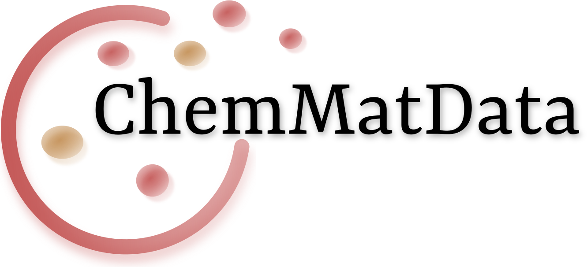

# ChemMatData
## Global collection of molecular and materials datasets

---
<!-- ABOUT THE PROJECT -->
## About The Project
Our main goal is to create a collaborative platform
where we can gather and categorize various datasets,
making them conveniently accessible in one place.
We are actively collecting datasets for [molecules](https://github.com/aimat-lab/ChemMatData/blob/main/molecules.md) as well as [crystalline structures](https://github.com/aimat-lab/ChemMatData/blob/main/materials.md) to provide a comprehensive resource for researchers, scientists, and enthusiasts.

See the list of all [molecular datasets](https://github.com/aimat-lab/ChemMatData/blob/main/molecules.md).
See the list of all [materials datasets](https://github.com/aimat-lab/ChemMatData/blob/main/materials.md).

---
<!-- CONTRIBUTING -->
## Contributing
If you have additional datasets that you believe should be included in our repository, we encourage you to [contribute](https://github.com/aimat-lab/ChemMatData/blob/main/CONTRIBUTE.md).
Here's how you can do it:
1. Send a link to a missing dataset or your own dataset with a short description to Jana (jana.zeller@student.kit.edu) and Pascal (pascal.friederich@kit.edu).
2. Directly add your dataset to the table in your browser.
3. Clone and extend this repository ([detailed description here](https://github.com/aimat-lab/ChemMatData/blob/main/CONTRIBUTE.md))

We appreciate your contribution and look forward to incorporating your suggested datasets into our growing collection!

---
<!-- CONTRIBUTORS -->
## List of contributors

Send us pull requests or emails with new datasets if you want to see your name here!

---
<!-- CONTACT -->
## About Us
An open-source project hosted by the [AiMat Group](https://aimat.iti.kit.edu/) at the [Karlsruhe Institute of Technology (KIT)](https://www.kit.edu/).

